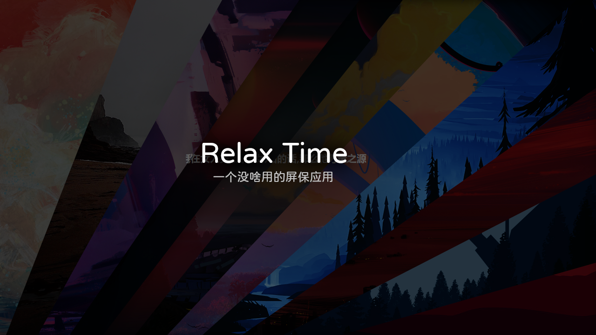
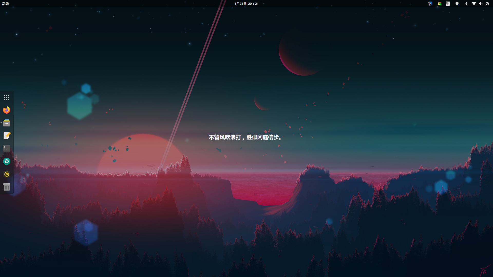

# Relax-time

#### 介绍
一款使用qt开发的屏保工具，使用一言API。
代码很垃圾，大佬们轻喷。

#### 编译
```
cd relax-time
mkdir build &&cd build
qmake ..
make
```

#### 截图


#### 使用说明
（1）、编译完成后请将backgrounds文件夹复制/移动到编译目录中，与编译后的代码文件处在同一目录，否则将无法加载壁纸。

（2）、按H隐藏控制部件，按S显示控制部件，按R更换背景/文字，按Esc退出。

（3）、【骚操作】按H隐藏控制部件后截图，可以当成壁纸使用哦😮️

eg:


     

#### 参与贡献
还是算了吧
